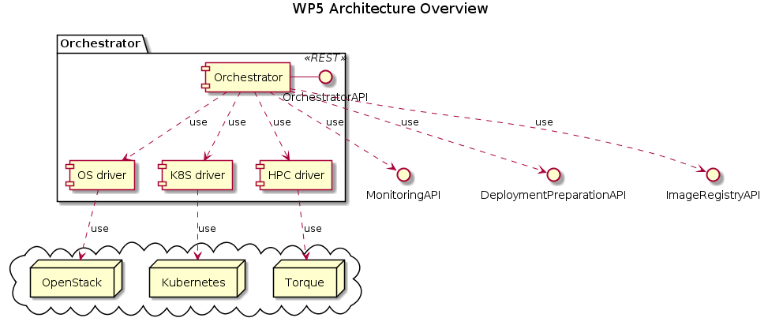

# orchestrator

## Description

The Orchestrator is part of the SODALITE Runtime Layer. It is in charge of the deployment and reconfiguration of SODALITE applications. It takes an IaC blueprint (i.e., a TOSCA+Ansible playbooks file) and performs the deployment of the applications on heterogeneous infrastructures.

The orchestrator is composed of the orchestrator itself and drivers to connect to the different targets.

This repository contains two sub-repositories:
- xOpera as the orchestrator
- ALDE as the HPC driver

## Software requirements

* python3 and virtual environments

## Installation

Both projects contains detailed installation instructions. In general, you need to:

1. Create the virtual environment:

        $ python3 -m venv <env-dir>
        $ source <env-dir>/bin/activate

2. Install the pip packages

        $ cd <project-dir>
        $ pip install

3. Run!

## Usage

Check individual repositories on usage guides. 

